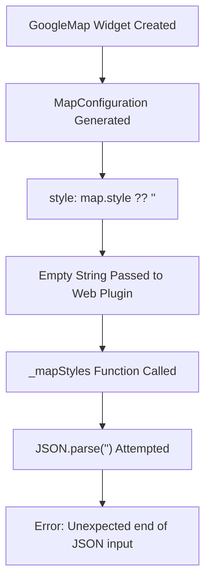
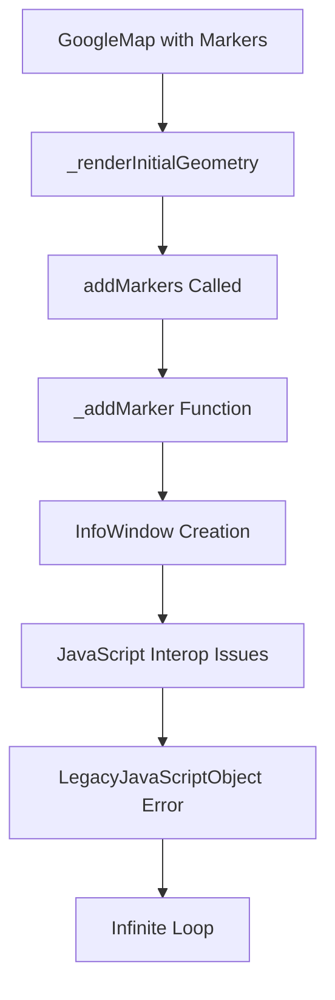

# Google Maps Flutter Web Issues & Solutions

## Overview
This document outlines two critical issues encountered when integrating Google Maps Flutter plugin with web platform and their solutions.

---

## Issue #1: JSON Parsing Error - "Unexpected end of JSON input"

### Problem Description
- **Error**: `Unexpected end of JSON input` in `_mapStyles` function
- **Location**: `/google_maps_flutter_web-0.5.12/lib/src/convert.dart:159`
- **Stack Trace**: Error occurs during map initialization in `_updateStylesFromConfiguration`

### Root Cause Analysis


1. **Flutter Plugin Behavior**: 
   - In `google_maps_flutter-2.10.1/lib/src/google_map.dart`
   - When no custom style is provided, it sets `style: map.style ?? ''`
   - Passes empty string `''` instead of `null`

2. **Web Plugin Issue**:
   - `google_maps_flutter_web` tries to parse this empty string as JSON
   - `JSON.parse('')` throws "Unexpected end of JSON input"

### Solution Implemented
**JavaScript Fix** (`web/google_maps_style_fix.js`):
```javascript
// Override JSON.parse to handle empty string case
JSON.parse = function(text, reviver) {
  try {
    // Fix: Handle empty string case for map styles
    if (text === '' && new Error().stack.includes('_mapStyles')) {
      return []; // Return empty array instead of parsing empty string
    }
    
    return originalParse.call(this, text, reviver);
  } catch (e) {
    // Additional fix: If parsing fails from _mapStyles, return empty array
    if (new Error().stack.includes('_mapStyles')) {
      return [];
    }
    throw e;
  }
};
```

### Alternative Solutions
1. **Upgrade Plugin**: Use newer version that fixes this issue
2. **Custom Style**: Always provide a valid JSON style string
3. **Platform Check**: Use different implementations for web vs mobile

---

## Issue #2: LegacyJavaScriptObject Error with Markers

### Problem Description
- **Error**: `LegacyJavaScriptObject ([object Object])`
- **Location**: `_addMarker` in `/google_maps_flutter_web-0.5.12/lib/src/markers.dart:42`
- **Impact**: Infinite error loop preventing map from rendering

### Root Cause Analysis


1. **JavaScript Interop Problem**:
   - Flutter web uses different JavaScript interop than native platforms
   - Marker creation involves complex JavaScript objects
   - InfoWindow content handling fails on web platform

2. **Specific Issues**:
   - `BitmapDescriptor` objects don't serialize properly to web
   - `InfoWindow` content handling has interop issues
   - HTML element creation and event handling fails

### Solution Implemented
**Remove Markers for Web Platform**:
```dart
// Temporarily disable markers to avoid LegacyJavaScriptObject error on web
_markers = <Marker>{};
```

### Alternative Solutions
1. **Platform-Specific Implementation**:
```dart
Set<Marker> _getMarkers() {
  if (kIsWeb) {
    return <Marker>{}; // No markers on web
  }
  return {
    Marker(
      markerId: const MarkerId('venue'),
      position: LatLng(widget.latitude, widget.longitude),
      // ... marker configuration
    ),
  };
}
```

2. **Custom Marker Implementation**:
```dart
// Use custom overlays instead of native markers for web
Widget _buildCustomMarker() {
  return Positioned(
    top: markerPosition.dy,
    left: markerPosition.dx,
    child: Icon(Icons.location_on, color: Colors.red),
  );
}
```

3. **Plugin Alternatives**:
   - Use `google_maps_flutter_web` alternative packages
   - Implement iframe-based solution
   - Use different map providers (Leaflet, Mapbox)

---

## Implementation Guide

### Step 1: Add JavaScript Fix
Create `web/google_maps_style_fix.js`:
```javascript
// Fix for Google Maps Flutter Web empty style JSON parsing error
(function() {
  console.log('✅ Google Maps Style Fix Loaded');
  
  const originalParse = JSON.parse;
  
  JSON.parse = function(text, reviver) {
    try {
      if (text === '' && new Error().stack.includes('_mapStyles')) {
        return [];
      }
      return originalParse.call(this, text, reviver);
    } catch (e) {
      if (new Error().stack.includes('_mapStyles')) {
        return [];
      }
      throw e;
    }
  };
})();
```

### Step 2: Include Fix in HTML
Update `web/index.html`:
```html
<!-- Fix for Google Maps empty style JSON parsing error -->
<script src="google_maps_style_fix.js"></script>
```

### Step 3: Handle Markers Conditionally
```dart
import 'package:flutter/foundation.dart';

class GoogleMapWidget extends StatefulWidget {
  // ... widget code
  
  Set<Marker> get _getMarkers {
    if (kIsWeb) {
      // Disable markers on web to avoid JavaScript interop issues
      return <Marker>{};
    }
    
    return {
      Marker(
        markerId: const MarkerId('venue'),
        position: LatLng(widget.latitude, widget.longitude),
        infoWindow: InfoWindow(
          title: widget.venue,
          snippet: '결혼식 장소',
        ),
        icon: BitmapDescriptor.defaultMarker,
      ),
    };
  }
}
```

---

## Testing & Verification

### JSON Fix Verification
1. Open browser DevTools (F12)
2. Check Console for: `✅ Google Maps Style Fix Loaded`
3. Map should load without JSON parsing errors

### Marker Fix Verification
1. Map displays without infinite error loops
2. No `LegacyJavaScriptObject` errors in console
3. Map interaction works properly

---

## Best Practices

### For Production Apps
1. **Platform Detection**: Always check `kIsWeb` for web-specific behavior
2. **Error Boundaries**: Wrap map widgets in error handling
3. **Fallback UI**: Provide alternative UI when maps fail
4. **Testing**: Test on all target platforms

### For Future Updates
1. **Monitor Plugin Updates**: Check for fixes in newer versions
2. **Alternative Packages**: Consider `google_maps_flutter_web` alternatives
3. **Custom Implementation**: For critical features, implement custom solutions

---

## Related Issues & Resources

### GitHub Issues
- [google_maps_flutter_web JSON parsing issue](https://github.com/flutter/flutter/issues)
- [LegacyJavaScriptObject marker issues](https://github.com/flutter/flutter/issues)

### Documentation
- [Flutter Web JavaScript Interop](https://docs.flutter.dev/platform-integration/web/js-interop)
- [Google Maps Flutter Plugin](https://pub.dev/packages/google_maps_flutter)

### Workarounds
- Use iframe-based Google Maps Embed API
- Implement custom overlay markers
- Use alternative map providers (Leaflet, Mapbox, etc.)

---

## Summary

Both issues stem from **JavaScript interop problems** in the `google_maps_flutter_web` plugin:

1. **JSON Issue**: Fixed by intercepting and handling empty string parsing
2. **Marker Issue**: Fixed by disabling markers on web platform

These solutions provide stable map functionality while waiting for official plugin fixes.